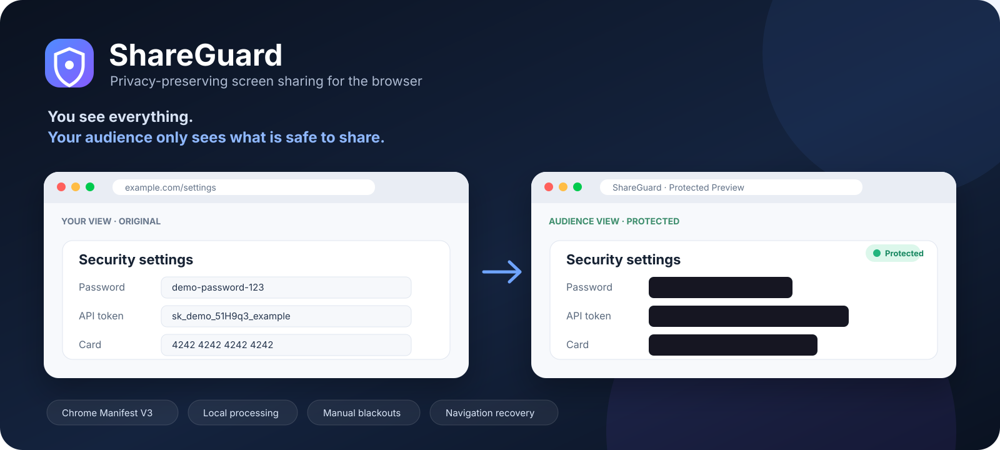

# ShareGuard

ShareGuard creates a separate browser view for screen sharing and hides selected sensitive information before the audience sees it.

Your original tab stays unchanged.



## What it does

ShareGuard currently handles:

- password fields and clearly labelled password values
- common API token formats and bearer tokens
- payment card numbers that pass the Luhn checksum
- manual blackout regions drawn by the user
- same-tab navigation without intentionally releasing an unchecked frame
- protected WebM recording for demos and testing

Detection runs inside the extension. The current version does not send page text to a backend.

## Try it

1. Clone this repository.
2. Open `chrome://extensions` or `edge://extensions`.
3. Enable Developer mode.
4. Choose Load unpacked.
5. Select the `extension/` folder.
6. Open the webpage you want to protect.
7. Click the ShareGuard toolbar icon.
8. Start protection.
9. Share the ShareGuard Studio window, not the original tab or desktop.

For `extension/demo.html`, enable file URL access in the extension settings first.

## How it works

The extension has four main parts.

`background.js`
Handles tab capture and reconnects the page scanner after navigation.

`scanner.js`
Reads visible webpage text and field metadata. It returns screen coordinates for sensitive regions. It does not modify the source page.

`detector.js`
Contains the local rules for passwords, tokens and payment cards.

`studio.js`
Draws captured frames to a canvas, applies the masks and shows the protected audience view.

More detail is in [docs/architecture.md](docs/architecture.md).

## Detection scope

| Category | Current method |
| --- | --- |
| Passwords | field type, field metadata and labelled values |
| API tokens | known prefixes, bearer tokens and labelled secrets |
| Payment cards | 13 to 19 digit candidates with a valid Luhn checksum |
| Other content | manual blackout |

The detector is intentionally narrow. It will miss some sensitive information.

## Current limits

The DOM scanner cannot automatically read text inside:

- screenshots and images
- video
- canvas content
- browser chrome
- many built-in PDF viewers
- inaccessible cross-origin frames
- browser pages such as `chrome://settings`

Do not rely on this prototype to protect real credentials or financial information. Test with fictional data and check the audience view before using it.

## Tests

Run the fast checks:

```bash
npm run check
```

Run the Chromium smoke tests:

```bash
python -m pip install -r requirements-dev.txt
python -m playwright install chromium
npm run test:browser
```

## Next work

The useful next steps are:

1. verify that the captured tab always matches the tab being scanned
2. measure scan and rendering latency
3. avoid rescanning unchanged page content
4. test local PII detection for names, email addresses, phone numbers and similar data
5. add local OCR for text that is not available through the DOM

The privacy model stays local by default.

## Status

ShareGuard is a working proof of concept. It is not a production security boundary.

## License

MIT
